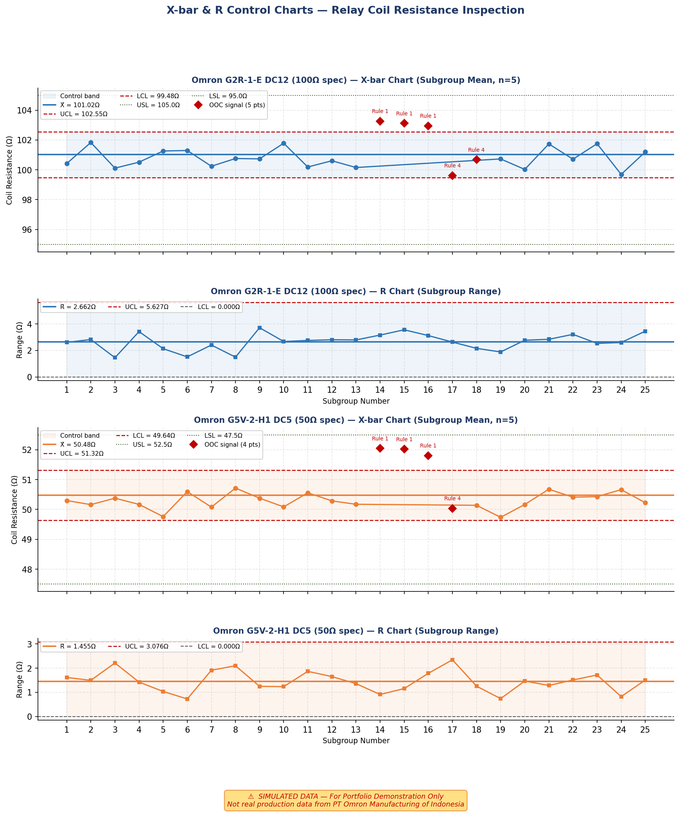

# SPC Dashboard — In-Process Quality Control
### Statistical Process Control for Relay Coil Resistance Monitoring

> ⚠️ **DISCLAIMER: All data in this project is simulated / dummy data generated for portfolio demonstration purposes only. This is not real production data from PT Omron Manufacturing of Indonesia or any other company.**

---

## Overview

This project implements a **Statistical Process Control (SPC) dashboard** for monitoring relay coil resistance during in-process quality control (IPQC) inspection. Built in Python using `matplotlib`, `numpy`, and `scipy`.

The dashboard monitors two Omron relay products:
- **G2R-1-E DC12** — Coil Resistance: 100Ω ± 5% (LSL: 95Ω, USL: 105Ω)
- **G5V-2-H1 DC5** — Coil Resistance: 50Ω ± 5% (LSL: 47.5Ω, USL: 52.5Ω)

This type of analysis is directly applicable to IPQC roles in electronic component manufacturing, where coil resistance is a critical quality parameter for relay and switch products.

---

## Dashboard Outputs

### 1. X-bar & R Control Charts


Monitors **subgroup mean** and **subgroup range** across 25 subgroups (n=5 per subgroup).

- Control limits calculated using **AIAG SPC Manual constants** (A2=0.577, D4=2.114 for n=5)
- **Western Electric Rules** applied for out-of-control detection:
  - Rule 1: Point beyond 3σ
  - Rule 2: 9 consecutive points same side of centerline
  - Rule 3: 6 points continuously trending
  - Rule 4: 2 of 3 consecutive points beyond 2σ
- OOC signals annotated directly on chart
- Deliberate mean shift injected at subgroups 13–15 to simulate tool wear / process drift

---

### 2. p-Chart — Batch Defect Rate


Monitors **proportion defective** across 20 inspection batches (~80–120 units per batch).

- Variable sample size → variable control limits per batch
- Out-of-control batches highlighted with annotation
- Simulated spike at batch 11 to demonstrate detection capability

---

### 3. Process Capability Analysis (Cp, Cpk)


Quantifies how well the process fits within specification limits.

| Index | Formula | Interpretation |
|-------|---------|----------------|
| **Cp** | (USL − LSL) / 6σ | Potential capability (spread vs spec width) |
| **Cpk** | min[(USL−μ)/3σ, (μ−LSL)/3σ] | Actual capability (accounts for centering) |
| **σ Level** | Cpk × 3 | Sigma quality level |
| **PPM** | Based on normal distribution tail area | Expected defects per million units |

Target: **Cpk ≥ 1.33** (industry standard for stable processes)

---

### 4. Summary Dashboard


Single-page summary combining all charts with a **KPI table** comparing both products against targets:

| Parameter | G2R-1-E DC12 | G5V-2-H1 DC5 | Target |
|-----------|-------------|-------------|--------|
| Cp | 1.193 | 1.025 | ≥ 1.33 |
| Cpk | 0.950 | 0.828 | ≥ 1.33 |
| Expected PPM | 2,188 | 6,642 | < 64 |
| OOC Signals | 5 | 4 | 0 |

Both products show **process centering issues** (Cp > Cpk gap) — indicating the mean is shifted toward USL. Recommended corrective action: adjust process mean toward nominal to improve Cpk.

---

## Technical Implementation

```python
# Key libraries
numpy        # Data generation and numerical computation
scipy.stats  # Normal distribution, probability calculations
matplotlib   # All chart rendering (pure matplotlib, no Seaborn)

# SPC Methods implemented
- X-bar & R chart (AIAG SPC Manual, 2nd Ed.)
- p-chart with variable control limits
- Process capability indices (Cp, Cpk, Cpu, Cpl)
- Western Electric Rules (4 of 8 rules)
- Normal distribution overlay with out-of-spec shading
```

---

## How to Run

```bash
# Install dependencies
pip install numpy scipy matplotlib

# Run dashboard (generates 4 PNG files in /output)
python3 spc_dashboard.py
```

Output files generated:
```
01_xbar_r_chart.png       — X-bar & R charts (both products)
02_pchart.png             — Batch defect rate p-charts
03_capability.png         — Capability histograms + Cp/Cpk report
04_summary_dashboard.png  — Full 1-page summary dashboard
```

---

## Context & Relevance

This project was developed as a **portfolio piece** demonstrating practical application of SPC methodology in an electronic component manufacturing context.

The workflow implemented here directly mirrors the **IPQC process** used in relay and switch manufacturing:

| Manufacturing Step | This Project |
|-------------------|-------------|
| Incoming coil resistance inspection | X-bar & R chart monitoring |
| Batch-level defect rate tracking | p-chart with OOC detection |
| Process performance reporting | Cp/Cpk capability analysis |
| KPI summary for management | Summary dashboard with status table |

Background: The author has hands-on experience performing **incoming QC inspection** on electronic components (relay, switch, sensor) at the Sensor & Telecontrol Systems Laboratory, Dept. of Nuclear Engineering & Engineering Physics, Universitas Gadjah Mada — including visual inspection, coil resistance measurement, continuity testing, and switching response verification using multimeter and oscilloscope.

---

## Author

**Naufal Suryo Saputro**
Bachelor of Engineering, Engineering Physics — Universitas Gadjah Mada (Jan 2026)
[LinkedIn](https://linkedin.com/in/naufal-suryo) | [GitHub](https://github.com/suryonaufal)

---

*⚠️ Simulated data — for portfolio demonstration only. Not real production data.*
